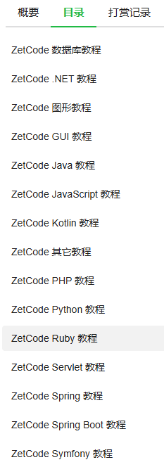

# 前端

## TypeScript

### 深入理解 TypeScript

https://github.com/jkchao/typescript-book-chinese

## Math.js

https://developer.mozilla.org/zh-CN/docs/Web/JavaScript/Reference/Global_Objects/Math

# 教程

## [ZetCode 中文系列教程](https://www.kancloud.cn/apachecn/zetcode-zh/1950566)

